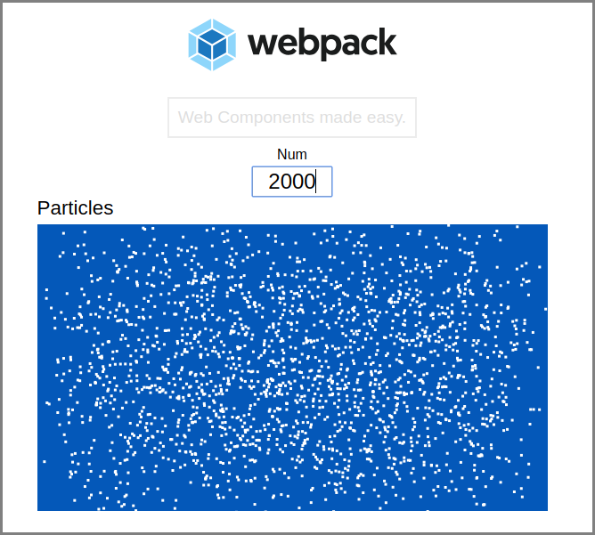

# webpack-webcomponent-example

Simple example for Webpack + Web Components

[1. What](#1-what)  
[2. Installed NPM Packages](#2-installed)  
[3. Web Component Examples](#3-examples)  
[4. Run & Build](#4-run-build)  
[5. License](#5-license)



[Demo](http://tokyo800.jp/minagawah/webpack-webcomponent-example)

<a name="1-what"></a>
## 1. What

To simply put, this repo provides some Web Component examples to show you
that they actually work even in an ordinary Webpack project.

- [Webpack4](https://webpack.js.org/guides/getting-started/)  
Using `HtmlWebpackPlugin` to output `dist/index.html`  
(and that's where you see the examples embedded)
- [webcomponents.js (v1)](https://github.com/webcomponents/webcomponentsjs)  
Widely used polyfill (for v1 spec). Check `index.html` for `<script>`
which links to `webcomponents-bundle.js` they provide (via CDN).
- Defined without using **class** syntax  
All 3 examples are defined in a good 'ol prototypal style.

Web Components (v1 spec) is composed of 3 major technologies:


**Custom Elements**  
Lets you define your own element, like `<scotty-beam-me-up>`.

**Shadow DOM**  
Lets you encapsulate styles (to, so called, `this.shadowRoot`)

**HTML Template**  
I'm not using this because I don't need to.

Since these are still a proposed spec,
we can't just write Web Components and expects browsers to understand what we write.
Hence, we need a polyfill,
such as [webcomponents.js (v1)](https://github.com/webcomponents/webcomponentsjs).
As long as we have the polyfill in `index.html`,
we can pretend as if we live in the future.

**Webpack has nothing to do with Web Component.**  
So, keep in mind, although this repo sounds like
it is integrating these two, it is not.
Think of the Webpack here simply outputs an ordinary `index.html`,
and the custom elements are just embedded there
as if they know nothing about Webpack at all.

Though, I have to also remind you
that example components are written in ES6,
and I let the host (meaning, Webpack) to transpile the codes.
This, it just mean that I am too lazy to write the examples in vanilla Javascript,
or do the transpilations in their own projects.
In real case scenario, I would publish each component as a NPM package,
and have its own transpilation environment.


<a name="2-installed"></a>
## 2. Installed NPM packages

These are the installed NPM packages.
As you can see, there's nothing special about them,
just ordinary packages and plugins to make an ordinary Webpack4 project.  
You may notice `html-loader` isn't really necessary here,
but it is explained in one of the component examples we have.

```
yarn add --dev babel-loader @babel/core @babel/preset-env eslint babel-eslint webpack webpack-cli style-loader css-loader postcss-loader autoprefixer file-loader html-loader html-webpack-plugin clean-webpack-plugin mini-css-extract-plugin copy-webpack-plugin webpack-manifest-plugin webpack-dev-server webpack-merge

yarn add ramda
```

<a name="3-examples"></a>
## 3. Web Component Examples

### (a) &lt;floating-particles&gt;

Provides `<canvas>` with a number of floating particles.
It has a `<slot name="title">` to which you can give its TITLE.
Basically, this component keeps watching 3 variables:

1. width
2. height
3. num

**width** and **height** are calculated within the caller (`app.js`, the parent).
**num**, as the name says, "number of particles".
There is another custom element called `<slightly-big-input>`,
and the parent `app.js` keeps watching the value entered.

### (b) &lt;merely-nothing&gt;

It watches 2 variables:

1. padding
2. message

It is nothing but a `<div>` and it just shows **message** given.
When **padding** is given, it changes the padding.  
While the other examples attach `style` and `template`
directly to the `shadowRoot`,
this example loads external `style.css` and `template.html`.
Since you usually have ways to load external resources (unless using `fetch`, etc.),
it means that this specific example depends on the parent's Webpack features.
Although this is totally against the idea of Web Components
(since every component should be independent),
I thought I should just demonstrate the case where a child depending on its parent.

### (c) &lt;slightly-big-input&gt;

It takes no variables. Nor, does any fancy stuff.
It just make `<input>` element slightly bigger.  
Except, notice at the very bottom,
when I do `customElements.define`, I have `{ extends: 'input' }`.
This means, you can do this (in the parent):  
`<input is="slightly-big-input">`

<a name="4-run-build"></a>
## 4. Run & Build

### Dev

Launches a Webpack Dev Server on your local port.

```
yarn start
```

### Prod

This will create a directory `dist` and put all the bundled chunks in there.

```
yarn run build
```

<a name="5-license"></a>
## 5. License

See [LICENSE](./LICENSE) for details.

